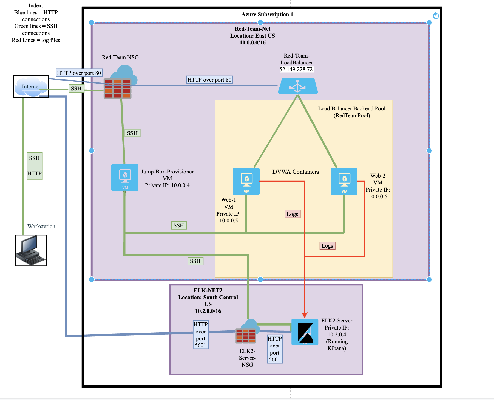

## Automated ELK Stack Deployment

The files in this repository were used to configure the network depicted below.




These files have been tested and used to generate a live ELK deployment on Azure. They can be used to either recreate the entire deployment pictured above. Alternatively, select portions of the playbook file may be used to install only certain pieces of it, such as Filebeat.


[Install Docker and configure DVWA servers](Ansible/pentest.yml)

[Configure ELK server with docker](Ansible/install-elk.yml)

[Install filebeat on the DVWA VMs](Ansible/filebeat-playbook.yml)

[Install metricbeat on the DVWA VMs](Ansible/metricbeat-playbook.yml)

This document contains the following details:
- Description of the Topology
- Access Policies
- ELK Configuration
  - Beats in Use
  - Machines Being Monitored
- How to Use the Ansible Build


### Description of the Topology

The main purpose of this network is to expose a load-balanced and monitored instance of DVWA, the D*mn Vulnerable Web Application.

Load balancing ensures that the application will be highly available, in addition to restricting unauthorized access to the network.  Load Balancers protect the availability of data.
The Jump Box VM can be used to connect to other virtual machines within our virtual network.  By allowing only the Jump Box VM connectivity over the internet, we are enhancing security across the rest of our network. We can then use the Jump Box VM to connect to our other virtual machines.

Integrating an ELK server allows users to easily monitor the vulnerable VMs for changes to the logs and system traffic.

Filebeat is a logging agent that reads logs from the server(s) it is installed on and forwards those logs to a specified output for centralization.  

Metricbeat records metrics from the operating system and from the services running on the server it is installed on.

The configuration details of each machine may be found below.


| Name                 | Function                              | IP Address | Operating System |
|----------------------|---------------------------------------|------------|------------------|
| Jump-Box-Provisioner | Gateway                               | 10.0.0.4   | Linux            |
| Web-1                | DVWA                                  | 10.0.0.5   | Linux            |
| Web-2                | DVWA                                  | 10.0.0.6   | Linux            |
| ELK2                 | Monitoring                            | 10.2.0.4   | Linux            |

### Access Policies

The machines on the internal network are not exposed to the public Internet.

Only the Jump-Box-Provisioner machine can accept connections from the Internet. Access to this machine is only allowed from the following IP addresses:

(my personal public IP address)


Machines within the network can only be accessed by the Jump-Box-Provisioner VM.
The Jump-Box-Provisioner
Private IP address: 10.0.0.4

A summary of the access policies in place can be found in the table below.

| Name                 | Publicly Accessible | Allowed IP Addresses           |
|----------------------|---------------------|--------------------------------|
| Jump-Box-Provisioner | Yes                 | (my personal public IP address)|
| Web-1                | No                  | 10.0.0.4                       |
| Web-2                | No                  | 10.0.0.4                       |
| ELK2                 | No                  | 10.0.0.4                       |
### Elk Configuration

Ansible was used to automate configuration of the ELK machine. No configuration was performed manually, which is advantageous because...
Ansible is easy to use and powerful. Ansible can be used to update configurations on multiple servers at once.

The playbook implements the following tasks:

1) Install Docker
2) Install Python3
3) Install Docker Python module
4) Use more Memory
5) Download and launch a docker elk container

The following screenshot displays the result of running `docker ps` after successfully configuring the ELK instance.
(Diagrams/Docker_PS.png)

### Target Machines & Beats
This ELK server is configured to monitor the following machines:

Web-1: 10.0.0.5

Web-2: 10.0.0.6

We have installed the following Beats on these machines:

Filebeat

Metricbeat

These Beats allow us to collect the following information from each machine:

Filebeat collects system log files, which we can use to see all events that have happened and are currently happening on a specified server or servers.

Metricbeat collects host metrics used for monitoring performance, which we can use to track things such as memory usage and CPU.  

### Using the Playbook
In order to use the playbook, you will need to have an Ansible control node already configured. Assuming you have such a control node provisioned:

SSH into the control node and follow the steps below:

- Copy the playbook files to Jump-Box-Provisioner.

- Update the hosts file to include the private IP addresses of the DVWA servers as well as the private IP of the elkservers:

a sample of the hosts file:
```
# A collection of hosts belonging to the 'webservers' group
[webservers]
10.0.0.5 ansible_python_interpreter=/usr/bin/python3
10.0.0.6 ansible_python_interpreter=/usr/bin/python3
# A collection of hosts belonging to the 'elkservers' group
[elkservers]
10.2.0.4 ansible_python_interpreter=/usr/bin/python3
```

Run the playbook, and navigate to Web-1 to check that the installation worked as expected. After that navigate to Web-2 followed by the ELK server to check that all installations worked as expected.

[playbook used to install Docker and configure the Web-1 and Web-2 VMs with the DVWA web app:](Ansible/pentest.yml)

[playbook used to deploy and configure the ELK container on the ELK server:](Ansible/install-elk.yml)

[playbook used to set up filebeat on the DVWA webservers:](Ansible/filebeat-playbook.yml)

[playbook used to set up metricbeat in the DVWA webservers:](Ansible/metricbeat-playbook.yml)

Which file do you update to make Ansible run the playbook on a specific machine? How do I specify which machine to install the ELK server on versus which to install Filebeat on?

You update the Ansible hosts file to run the playbook on specified machines. Within the Ansible hosts file you create two separate groups. One is called [webservers] and the other is called [elkservers]. You then place the private IP addresses of the corresponding servers underneath each group header. Then within the playbook files you can specify whether the playbook should be applied to the webservers or elkservers.

Navigate to http://(ELK-Server public IP):5601/app/kibana in order to check that the ELK server is running


The specific commands the user will need to run to download the playbook:

Once connected to your jumpbox,

make sure the ansible hosts file is up to date

1) $ sudo su

2) $ cd/etc/ansible

3) $ ansible-playbook pentest.yml

4) $ ansible-playbook install-elk.yml

5) $ ansible-playbook filebeat-playbook.yml

6) $ ansible-playbook metricbeat-playbook.yml
